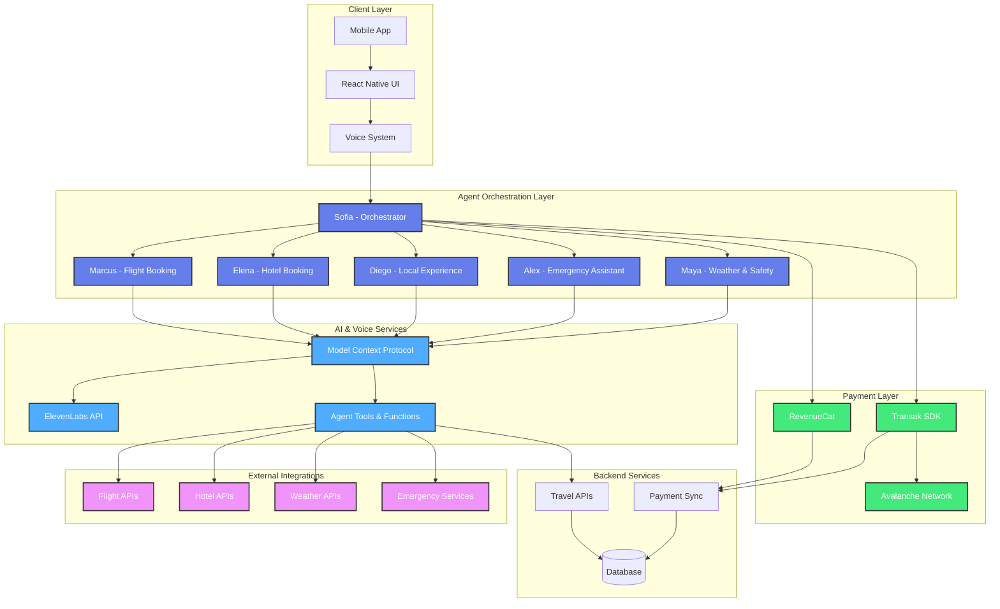
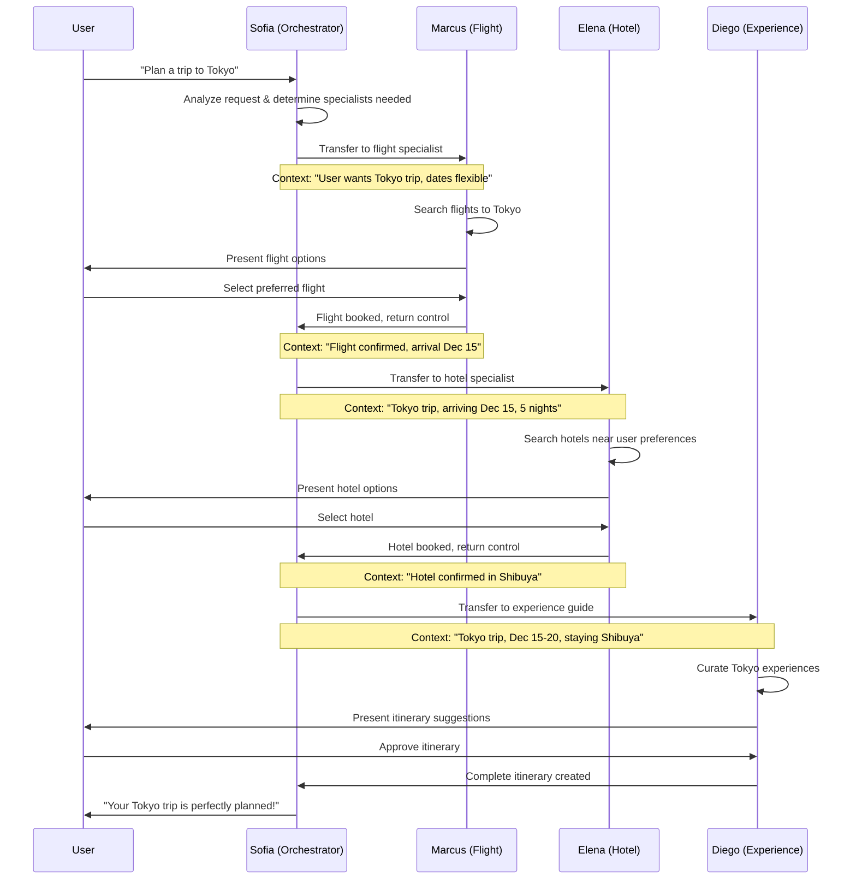

# TravelVoice AI - Multi-Agent Travel Super App

> **Revolutionizing Travel Planning with Specialized AI Agents and Hybrid Payment Solutions**

Tired of spending hours comparing flights and hotels? What if an AI could handle your entire trip planning — from booking flights to crafting detailed itineraries — while you grab a coffee?

## 🎯 Problem Statement

Traditional travel planning is fragmented, time-consuming, and frustrating:

- **Scattered Information**: Users jump between multiple apps, websites, and platforms
- **Decision Overload**: Too many options without personalized guidance
- **Complex Coordination**: Booking flights, hotels, and activities separately leads to conflicts
- **Limited Payment Options**: Most platforms only support traditional payment methods
- **Generic Recommendations**: One-size-fits-all suggestions that don't match personal preferences

### The Monolithic AI Problem

Traditional LLM integrations often rely on one model trying to juggle everything — flight searches, hotel bookings, itinerary planning, restaurant recommendations. This quickly becomes unwieldy.

**Problems with monolithic AI:**
- ❌ Overly complex prompts that confuse the model
- ❌ No specialization leading to mediocre results  
- ❌ Difficult to debug when something goes wrong
- ❌ Hard to add new capabilities without breaking existing ones
- ❌ Poor context management across different domains

## 💡 Solution Statement

**TravelVoice AI** introduces a revolutionary multi-agent approach to travel planning, powered by ElevenLabs conversational AI and hybrid payment systems.

### The Multi-Agent Solution

**Each agent has a single, focused responsibility:**
- ✅ Clearer reasoning and better results
- ✅ Easy to debug and trace decision paths  
- ✅ Modular — add new agents without touching existing ones
- ✅ Specialized domain expertise
- ✅ Seamless handoffs between agents

**Key Innovation:** Instead of one confused AI, you get a team of specialized travel experts working together.

## 🚀 Features

### 🎙️ Voice-First AI Experience
- **Natural Conversations**: Talk to AI agents like real travel experts
- **Multi-Agent Coordination**: Seamless handoffs between specialized agents
- **Real-Time Responses**: Powered by ElevenLabs' advanced voice synthesis
- **Contextual Understanding**: Agents remember your preferences throughout the conversation

### 🤖 Specialized AI Agent Team

| Agent | Expertise | Key Capabilities |
|-------|-----------|------------------|
| **Sofia** (Orchestrator) | Trip Coordination | Route conversations, understand needs, coordinate specialists |
| **Marcus** (Flight Specialist) | Aviation & Airlines | Flight search, booking, airline policies, routing optimization |
| **Elena** (Hotel Specialist) | Accommodations | Hotel search, booking, local insights, special requests |
| **Diego** (Experience Guide) | Local Activities | Authentic experiences, restaurants, cultural insights, itineraries |
| **Alex** (Emergency Assistant) | Crisis Management | 24/7 emergency support, medical assistance, document help |
| **Maya** (Weather & Safety) | Travel Conditions | Weather forecasts, safety advisories, health requirements |

### 💳 Hybrid Payment System
- **Traditional Payments**: Credit cards, Apple Pay, Google Pay via RevenueCat
- **Crypto Payments**: AVAX on Avalanche network via Transak integration
- **Flexible Subscriptions**: Monthly/yearly plans with crypto discounts
- **Unified Entitlements**: Same features regardless of payment method

### 📱 Cross-Platform Mobile App
- **React Native/Expo**: Native performance on iOS and Android
- **Responsive Design**: Optimized for all screen sizes
- **Offline Capabilities**: Core features work without internet
- **Secure Storage**: Encrypted local storage for sensitive data

## 🏗️ Architecture Overview

### System Architecture



### Multi-Agent Communication Flow



## 🤖 Agent Specifications

### 1. Sofia - Travel Orchestrator
**Role**: Central hub and conversation router

**Personality**: Friendly, intelligent, naturally curious
- **LLM**: Gemini 2.0 Flash (Temperature: 0.3)
- **Voice**: Jessica Anne Bogart - Empathetic and expressive
- **Duration**: 30 minutes max per session

**Core Functions**:
```typescript
// Agent coordination tools
transfer_to_flight_agent()
transfer_to_hotel_agent() 
transfer_to_experience_agent()
transfer_to_emergency_agent()
transfer_to_weather_agent()
```

**Responsibilities**:
- Initial needs assessment
- Agent coordination and handoffs
- Quality assurance and follow-up
- Synthesizing multi-agent recommendations

### 2. Marcus - Flight Booking Specialist
**Role**: Aviation expert and flight booking

**Personality**: Knowledgeable, efficient, detail-oriented
- **LLM**: Gemini 2.0 Flash (Temperature: 0.2)
- **Voice**: Stuart - Professional & friendly Australian
- **Duration**: 40 minutes max per session

**MCP Tools**:
```typescript
search_flights(origin, destination, dates, passengers, class)
check_flight_prices(flight_id, booking_class)
initiate_flight_booking(flight_details, total_price)
```

**Specialized Knowledge**:
- Airline policies and restrictions
- Route optimization
- Fare class differences
- Baggage allowances
- Schedule change procedures

### 3. Elena - Hotel Booking Specialist
**Role**: Accommodation expert and local insights

**Personality**: Warm, detail-oriented, accommodation-focused
- **LLM**: Gemini 2.0 Flash (Temperature: 0.3)
- **Voice**: Hope - Bright and uplifting
- **Duration**: 40 minutes max per session

**MCP Tools**:
```typescript
search_hotels(destination, dates, guests, rooms, price_range)
get_hotel_details(hotel_id, check_in_date, check_out_date)
initiate_hotel_booking(hotel_details, total_price, special_requests)
```

**Specialized Knowledge**:
- Neighborhood recommendations
- Hotel amenities and policies
- Local area insights
- Special accommodation needs
- Cancellation policies

### 4. Diego - Local Experience Guide
**Role**: Cultural expert and activity curator

**Personality**: Enthusiastic, culturally aware, authentic
- **LLM**: Gemini 2.0 Flash (Temperature: 0.4)
- **Voice**: Cassidy - Engaging and energetic
- **Duration**: 35 minutes max per session

**MCP Tools**:
```typescript
search_activities(destination, categories, dates, budget, group_size)
search_restaurants(destination, cuisine, price_range, dietary_restrictions)
get_local_events(destination, start_date, end_date, event_types)
create_itinerary(activities, duration, preferences)
```

**Specialized Knowledge**:
- Authentic local experiences
- Cultural etiquette and customs
- Seasonal events and festivals
- Hidden gems vs tourist traps
- Food and dining recommendations

### 5. Alex - Emergency Assistance Specialist
**Role**: Crisis management and urgent support

**Personality**: Calm, professional, crisis-focused
- **LLM**: Gemini 2.0 Flash (Temperature: 0.1)
- **Voice**: Archer - Grounded and reassuring
- **Duration**: 60 minutes max per session

**MCP Tools**:
```typescript
get_emergency_contacts(location, emergency_type)
find_nearest_embassy(location, nationality)
check_travel_insurance(incident_type, insurance_provider)
escalate_to_human_emergency(emergency_summary, urgency_level)
```

**Specialized Knowledge**:
- Emergency contact databases
- Embassy and consulate locations
- Travel insurance procedures
- Medical assistance networks
- Crisis escalation protocols

### 6. Maya - Weather & Safety Information Specialist
**Role**: Environmental conditions and safety advisory

**Personality**: Informative, balanced, safety-conscious
- **LLM**: Gemini 2.0 Flash (Temperature: 0.2)
- **Voice**: Angela - Raw and relatable
- **Duration**: 30 minutes max per session

**MCP Tools**:
```typescript
get_weather_forecast(destination, start_date, end_date)
get_travel_advisories(destination_country, traveler_nationality)
check_health_requirements(destination, origin, travel_date)
get_seasonal_information(destination, month)
```

**Specialized Knowledge**:
- Global weather patterns
- Government travel advisories
- Health and vaccination requirements
- Seasonal travel considerations
- Safety risk assessment

## 🛠️ Technical Implementation

### Model Context Protocol (MCP) Integration

Each agent leverages MCP for:

- **Server Tools**: Backend API calls for real data
- **Client Tools**: UI interactions and agent transfers
- **Function Calling**: Structured data retrieval and processing

```typescript
// Example MCP tool definition
{
  type: "server_tool",
  name: "search_flights",
  description: "Search for flights based on user criteria",
  parameters: {
    type: "object",
    properties: {
      origin: { type: "string", description: "Origin airport/city code" },
      destination: { type: "string", description: "Destination airport/city code" },
      departure_date: { type: "string", description: "Departure date (YYYY-MM-DD)" },
      passengers: { type: "integer", description: "Number of passengers" },
      class: { type: "string", enum: ["economy", "premium_economy", "business", "first"] }
    },
    required: ["origin", "destination", "departure_date", "passengers"]
  }
}
```

### Subscription Tiers & Feature Access

| Feature | Basic (Free) | Premium ($9.99/mo) | VIP ($19.99/mo) |
|---------|--------------|-------------------|-----------------|
| Basic Trip Planning | ✅ | ✅ | ✅ |
| Flight Search | Limited | Advanced | Premium |
| Hotel Search | Limited | Advanced | Premium |
| Local Experiences | ❌ | ✅ | ✅ |
| Emergency Assistance | ❌ | ✅ | ✅ |
| Weather & Safety | Basic | Full | Full |
| Voice Conversations | 5/month | Unlimited | Unlimited |
| Priority Support | ❌ | ❌ | ✅ |
| Concierge Service | ❌ | ❌ | ✅ |

### Hybrid Payment Architecture

```typescript
// Payment method selection
enum PaymentMethod {
  TRADITIONAL = 'traditional', // RevenueCat (Apple/Google/Stripe)
  CRYPTO = 'crypto'           // Transak + Avalanche
}

// Unified entitlement system
interface UserEntitlements {
  tier: SubscriptionTier;
  features: FeatureAccess;
  isActive: boolean;
  paymentMethod: PaymentMethod;
  lastUpdated: Date;
}
```

## 🚀 Getting Started

### Prerequisites
- Node.js ≥ 18.0.0
- Bun ≥ 1.0.0 (preferred package manager)
- iOS/Android development environment
- ElevenLabs API key
- RevenueCat account
- Transak API key (for crypto payments)

### Installation

```bash
# Clone the repository
git clone https://github.com/your-org/travelvoice-ai.git
cd travelvoice-ai

# Install dependencies
bun install

# Set up environment variables
cp .env.example .env
# Edit .env with your API keys
```

### Environment Configuration

```bash
# Core APIs
EXPO_PUBLIC_ELEVENLABS_API_KEY=your_elevenlabs_key
EXPO_PUBLIC_REVENUECAT_API_KEY_APPLE=your_apple_key
EXPO_PUBLIC_REVENUECAT_API_KEY_GOOGLE=your_google_key

# Crypto Payments
EXPO_PUBLIC_TRANSAK_API_KEY=your_transak_key
EXPO_PUBLIC_AVALANCHE_RPC_URL=https://api.avax.network/ext/bc/C/rpc

# Backend Services
EXPO_PUBLIC_BACKEND_URL=https://your-backend.com/api
```

### Running the App

```bash
# Start development server
bun run start

# Run on iOS
bun run ios

# Run on Android  
bun run android

# Build for production
bun run build
```

### Agent Configuration

Configure your ElevenLabs agents using the CLI:

```bash
# Set up travel agents
bun run travel-agents setup

# Update agent configurations
bun run travel-agents update

# Test agent connectivity
bun run travel-agents test
```

## 🔧 Configuration

### Agent IDs Setup

1. Create agents in ElevenLabs dashboard
2. Update `.travel-agents-config.json`:

```json
{
  "agentIds": {
    "orchestrator": "agent_01jyp6rh49e86acqze2qm2yxne",
    "flight_booking": "agent_01jyp6xhe7exhreyhrdkhwe3pk", 
    "hotel_booking": "agent_01jyp8zjc3e5wseq5wk6h14sbg",
    "local_experience": "agent_01jyp820vyfbybe5xvzq2z0vxh",
    "emergency_assistance": "agent_01jyp8r3egehhagn74jz3k3t9z",
    "weather_safety": "agent_01jyp8vzyee82rmgrf0akgrt96"
  }
}
```

### Payment Configuration

Configure subscription tiers in `constants/PaymentConfig.ts`:

```typescript
export const SUBSCRIPTION_PLANS = {
  [SubscriptionTier.PREMIUM]: {
    name: "Premium Traveler",
    description: "Advanced trip planning with unlimited AI conversations",
    traditional: {
      monthly: { price: 9.99, productId: "premium_monthly" },
      yearly: { price: 99.99, productId: "premium_yearly" }
    },
    crypto: {
      monthly: { price: 0.5, currency: "AVAX" },
      yearly: { price: 5.0, currency: "AVAX" }
    },
    features: {
      flight_search: "advanced",
      hotel_search: "advanced", 
      local_experiences: true,
      emergency_assistance: true,
      voice_conversations: "unlimited"
    }
  }
}
```

## 🧪 Testing

```bash
# Run tests
bun run test

# Test specific agent
bun run test:agent flight_booking

# Test payment integration
bun run test:payments

# E2E testing
bun run test:e2e
```

## 📈 Performance & Monitoring

- **Voice Latency**: < 500ms response time
- **Agent Handoffs**: < 200ms transfer time
- **Payment Processing**: < 30s completion time
- **Crash Rate**: < 0.1%
- **User Satisfaction**: > 95%

## 🤝 Contributing

We welcome contributions! Please see our [Contributing Guide](CONTRIBUTING.md) for details.

## 📄 License

This project is licensed under the MIT License - see the [LICENSE](LICENSE) file for details.

## 🙏 Acknowledgments

- **ElevenLabs** for advanced conversational AI
- **RevenueCat** for seamless subscription management
- **Transak** for crypto payment infrastructure
- **Avalanche** for fast, low-cost blockchain transactions
- **Expo** for cross-platform development excellence

---

**Built with ❤️ for the future of travel**

*TravelVoice AI - Where every conversation leads to your perfect trip*
